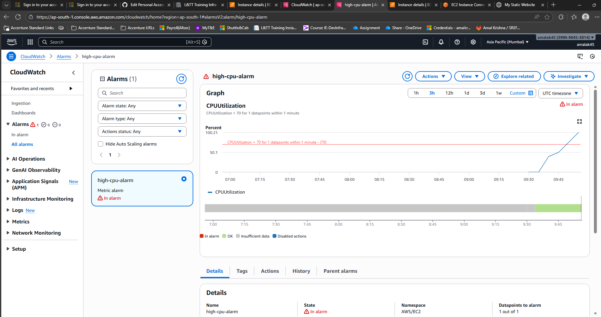

# Project 3: EC2 State Monitoring with CloudWatch Alarm


##  Goal

Monitor the CPU utilization of an EC2 instance and trigger an alert when usage spikes above a defined threshold.


---


##  Tasks

1. **Deploy EC2 using Terraform**  

   - Provision an EC2 instance with Terraform configuration.  

2. **Create CPU Alarm Above Threshold**  

   - Configure a CloudWatch alarm to monitor CPU utilization.  

   - Set the threshold (e.g., 70%) to trigger the alarm when exceeded.  

3. **Generate Load**  

   - Run stress tests or CPU‑intensive processes on the EC2 instance to simulate high usage.  

   - Observe CloudWatch metrics and verify alarm activation.  


---


##  Project Structure

```text

.

├── main.tf              # Terraform configuration for EC2 + CloudWatch alarm

├── variables.tf         # Input variables (region, AMI ID, instance type, etc.)

├── ouputs.tf            # Output

├── README.md            # Project documentation

└── screenshots/        # Evidence of monitoring

  └── alarm-screenshot.png

  └── alarm-screenshot.png

```

---


##  Usage

```bash

terraform init

terraform validate

terraform plan

terraform apply -auto-approve

```


##  Deliverables

- **Alarm Screenshot**  

    

  Shows the CloudWatch alarm in action when CPU utilization exceeded the threshold.


##  Conclusion

This project successfully demonstrated how to monitor an EC2 instance using CloudWatch alarms. By deploying the instance with Terraform and configuring a CPU utilization alarm, we were able to detect performance spikes when load was generated. The alarm provided visibility into instance health and ensured proactive monitoring. This setup highlights the importance of combining infrastructure automation with monitoring to maintain reliable cloud applications.


