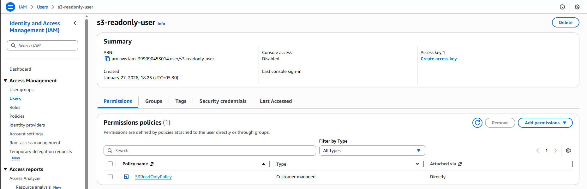
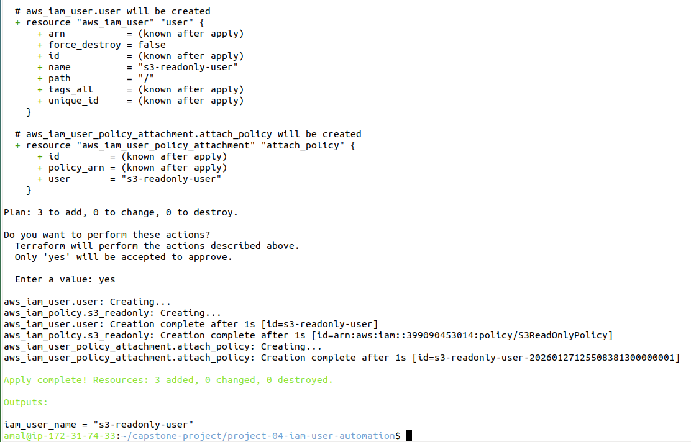

# Project 4: IAM User Automation with Terraform


##  Goal

Automate the creation of IAM users with controlled permissions using Terraform.  

This project demonstrates how to provision IAM users and attach a read‑only S3 policy for secure access management.


---


##  Tasks

1. **Create IAM User with S3 Read Policy**  

   - Provision an IAM user via Terraform.  

   - Attach a custom policy that grants read‑only access to S3 buckets.  


2. **Store Policy as Variable**  

   - Define the S3 read‑only policy in a JSON file (`policy/s3-readonly-policy.json`).  

   - Reference the policy in Terraform using variables for reusability.  


---


##  Project Structure


```text


├── main.tf                      # Terraform resources (IAM user, policy, attachments)

├── variables.tf                 # Input variables (region, user names, etc.)

├── output.tf                    # Outputs (IAM user name, ARN)

├── policy/

│   └── s3-readonly-policy.json  # JSON definition of S3 read-only policy

├── README.md                    # Project documentation

└── screenshots/

  ├── iam-user-console.png       # Evidence from AWS console

  └── iam-user-created.png       # Evidence of IAM user creation


```


---


## Initialize Terraform


```bash


terraform init


terraform validate


terraform plan


terraform apply 


terraform output


```


##  Deliverables


- **Test Evidence**

  -   

    Screenshot showing the IAM user listed in the AWS Management Console.

  -   

    Screenshot confirming successful IAM user creation.


- **Repository Link**  

  [Your Repo Link](https://github.com/your-username/project-04-iam-user-automation)


##  Conclusion

This project demonstrated how Terraform can be used to automate IAM user management with controlled permissions. By defining the S3 read‑only policy as a reusable variable and attaching it to newly created IAM users, we ensured secure and consistent access control. The automation reduces manual effort, enforces least‑privilege principles, and provides a scalable approach to managing IAM users across environments.


✔ Project completed successfully


