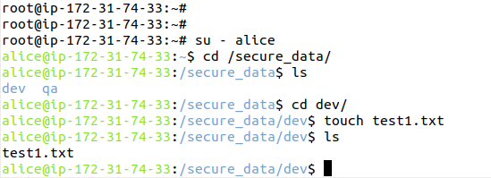
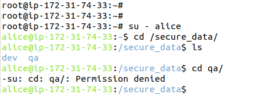
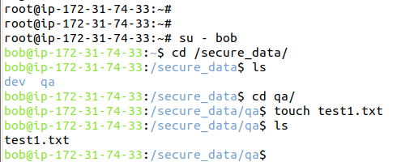
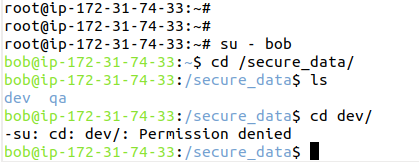

# Project 5: Secure Linux Server Permissions

## Goal
Apply user-based access restrictions on a Linux server using users, groups, and file permissions.

---

## Overview
This project demonstrates how Linux access control can be implemented to ensure that users
only access directories they are authorized to use.

Two users were created and assigned to separate groups. Each group was granted exclusive
access to its respective directory, while all other access was denied.

---

## Users and Access Design

| User  | Group | Allowed Directory |
|------|------|------------------|
| alice | dev  | /secure_data/dev |
| bob   | qa   | /secure_data/qa  |

Each directory is protected using group ownership and permission bits (`770`), ensuring:
- Full access for the owner and group
- No access for others

---

## Validation Summary
Access was validated by logging in as each user and testing both allowed and restricted directories.
Successful access and permission-denied scenarios were confirmed.

---

## Screenshots

### Alice – Allowed Access (dev directory)

---

### Alice – Denied Access (qa directory)

---

### Bob – Allowed Access (qa directory)

---

### Bob – Denied Access (dev directory)

---

## Conclusion
This project reflects real-world Linux server security practices where role-based access control
is essential for protecting sensitive data in multi-user environments.

✔ Project completed successfully
