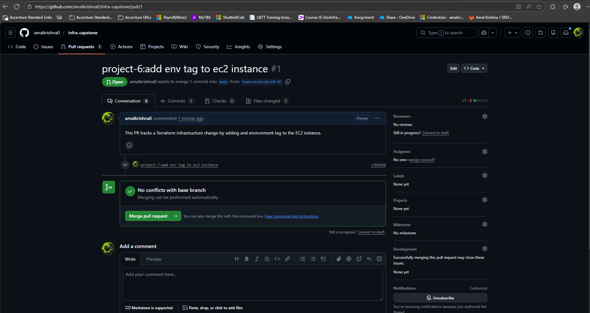

# Project 6 - Version Control Infrastructure

##  Goal

Track Terraform infrastructure changes using Git and Pull Requests

---

## Description

This project demonstrates how infrastrucutre code is managed safely using Git.

A Terraform change was made in a seperate feature branch and merged into the `main` branch using a Pull Request, following standard DevOps practices.

---

##  Changes Made

Added an Enviornment tag to the EC2 instance in ***Project 1***

---

## Workflow Followed

1. Created a feature branch

2. Made a Terraform infrastructure change

3. Commited the change to the feature branch

4. Pushed the branch to GitHub

5. Raise a Pull Request

6. Merged the Pull Request into `main`

---

## Sreenshots

### Pull Request Created

### Pull Request Merged

---

## Deliverables

- **Pull Request Link:**

 `https://github.com/amalkrishna0/infra-capstone/pull/1`

---

## Conclusion

This project highlights the importance of version control in infrastructure management.By using feature branche and Pull Request, infrastructure changes can be viewed, tracked and safely merged, reducing the risk of errors and improving collaboration in real-world DevOps environment

✔ Project completed successfully
