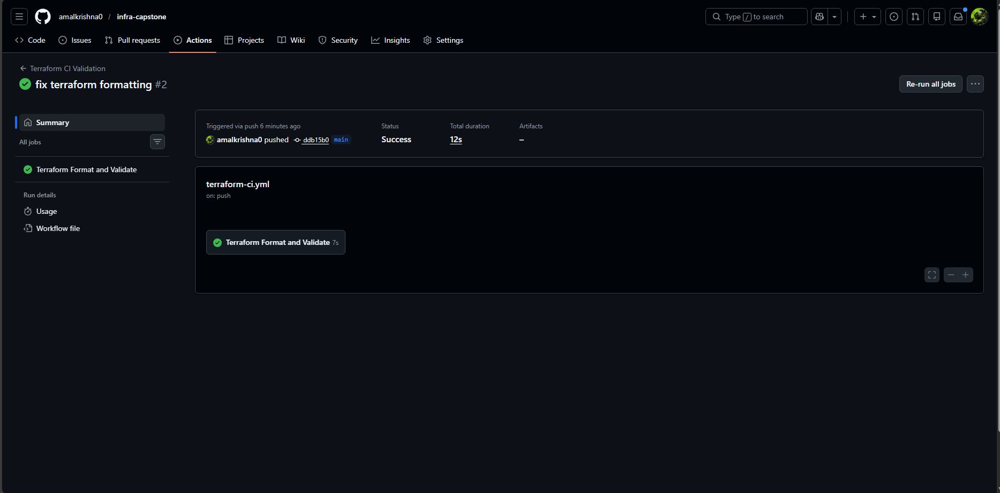
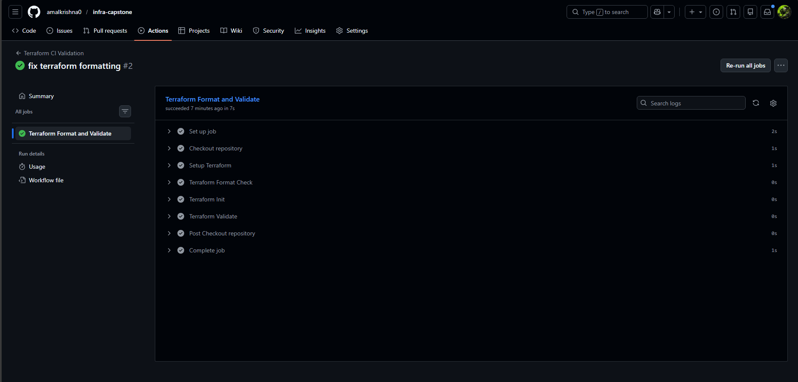

# Project 7: CI Validation for Terraform


##  Goal

Automate lint and validation checks for Terraform code using GitHub Actions.


---


##  Tasks

1. **Run Terraform fmt**  

   Ensure all Terraform files are properly formatted on every push.  


2. **Run Terraform validate**  

   Validate Terraform configuration to catch syntax or logical errors early.  


3. **Add Workflow Badge**  

   Display the CI status badge in the README for quick visibility.  


---


##  GitHub Actions Workflow

The workflow is defined in `.github/workflows/terraform-ci.yml` and runs on:

- Pushes to `main` and `feature/*` branches

- Manual trigger via `workflow_dispatch`


### Workflow Badge


---


##  Project Structure


```text

├── .github/

│   └── workflows/

│       └── terraform-ci.yml      # CI workflow definition

├── project-07-terraform-ci-validation

|  └── README.md                     # Project documentation

|  └──screenshots/

|     └──github-actions.png         # Screenshot of successful GitHub Actions run

|     └── pipeline.png               # Screenshot of pipeline logs (all steps)

```


---


## Usage

- Push changes to `main` or any `feature/*` branch.  

- GitHub Actions will automatically run `terraform fmt -check` and `terraform validate`.  

- Check the **Actions tab** in your repository to see results.  


---


##  Deliverables

- **GitHub Actions Run (Successful CI Testing)**  

  


- **Pipeline Logs (Steps Output)**  

  


---


##  Conclusion

This project demonstrates how to integrate Terraform validation into CI pipelines. Automating `terraform fmt` and `terraform validate` ensures consistent code quality and prevents misconfigurations from being merged into the main branch. The screenshots provide evidence of successful CI execution and validation of all steps.


✔ Project completed successfully


