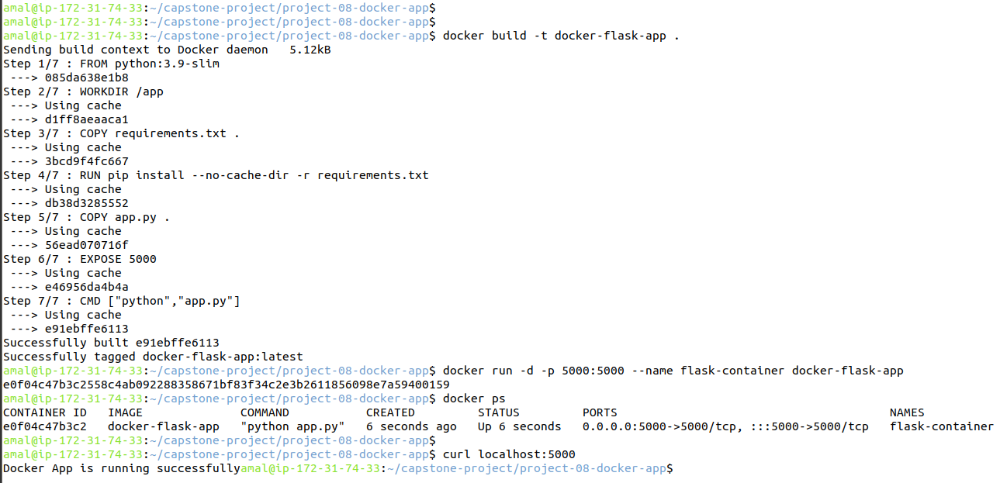

# Project 8 : Build and Run Docker App Locally

## Goal

Practice container deployment by building and running a Dockerized application locally.

---

## Overview

This project demonstrates the use of Docker to containerize a simple web application.

A Python Flask app was packaged into a Docker image and executed as a container on local system.

The application runs inside an isolated container environment and is exposed to the host machine using port mapping

---

## Technologies Used

- Docker

- Python

- Flask

## Application Details

- Base Image: python:3.9-slim

- Application Port: 5000

- Container Runtime: Docker Engine

---

## Execution Summary

1. A Dockerfile was created to define the application image

2. The Docker image was built locally.

3. The container was run with port mapping.

4. The application was accessed via browser on localhost.

---

## Screenshot

### Docker Container Running Locally

---

## Conclusion

This project validates core Docker concepts including image creation, container execution, and application exposure. Containerization ensures portability and consistency across enviroments.

✔ Project completed successfully

