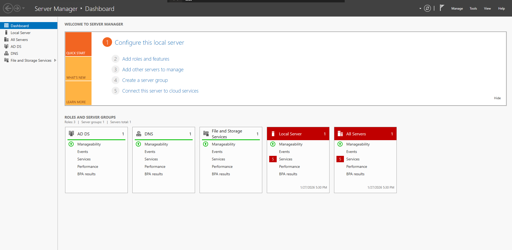
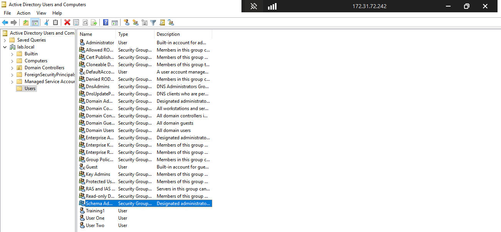
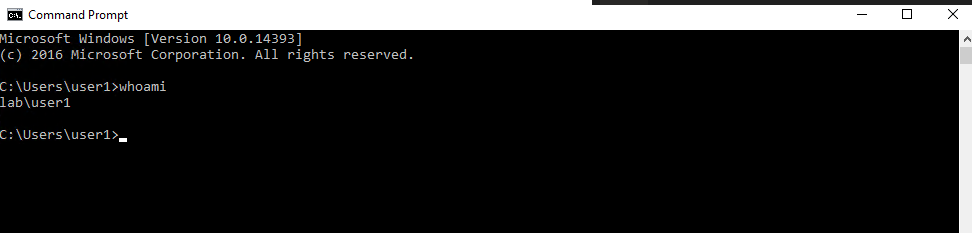

# Project 9 – Domain Controller Setup

 

## Goal

Practice basic authentication by setting up a **Windows Domain Controller** and managing **domain users** using Active Directory.

 

---

 

## Description

In this project, a Windows Server was configured as a **Domain Controller** by installing **Active Directory Domain Services (AD DS)**.  

A new domain was created, two domain users were added, and domain authentication was verified by successfully logging in as one of the users.

 

---

 

## Tasks Completed

- Installed **Active Directory Domain Services (AD DS)**

- Promoted the server to a **Domain Controller**

- Created two domain users (`user1` and `user2`)

- Verified domain authentication by logging in as `user1`

 

---

 

## Screenshots (Proof of Work)

 

### Active Directory Domain Services Installed



 

---

 

### Domain Users Created



 

---

 

### Domain User Login Successful



 

---

 

## Project Structure

 

```text

project-09-domain-controller/

├── README.md

└── screenshots/

    ├── ad-ds-installed.png

    ├── domain-users.png

    └── user1-login.png
