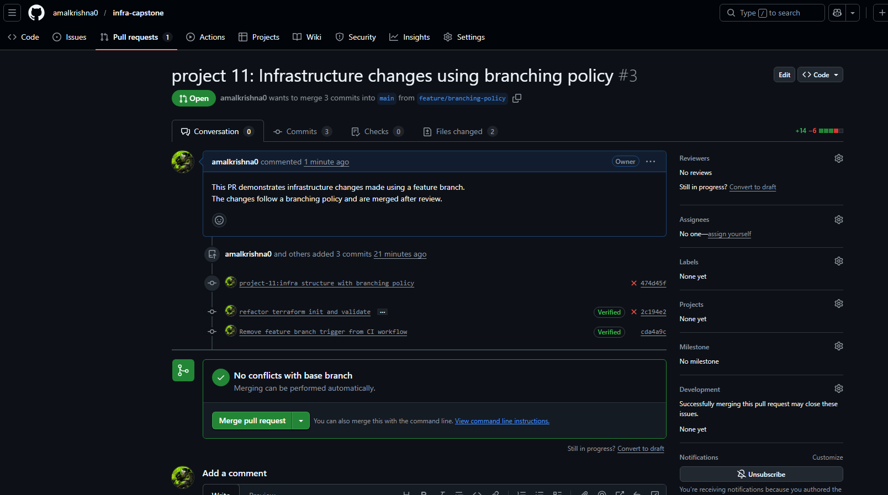
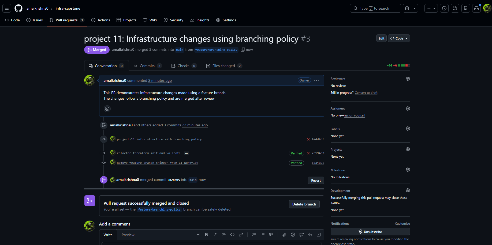

# Project 11 – Infrastructure Changes with Branching Policy

 

## Goal

Follow a branching strategy for infrastructure changes using Git.

 

---

 

## Description

This project demonstrates the use of a feature branch to implement infrastructure changes.

The changes were reviewed and merged into the main branch using a Pull Request, following standard DevOps branching practices.

 

---

 

## Workflow Followed

1. Created a feature branch from `main`

2. Made an infrastructure-related change

3. Raised a Pull Request

4. Reviewed and merged the Pull Request

 

---

 

## Screenshots (Proof of Work)

 

### Pull Request Created

 

---

 

### Pull Request Merged

 

---

 

## Status

✅ Completed
