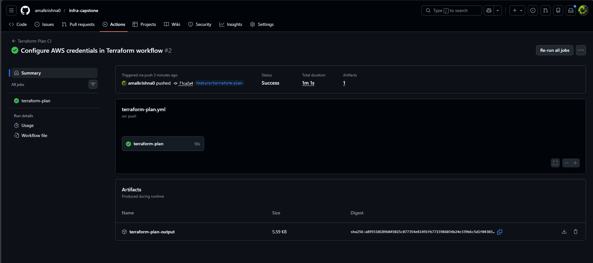

# Project 12 – Infrastructure CI Trigger (Terraform Plan)

 

## Goal

Validate infrastructure changes by automatically running **Terraform plan** in a CI pipeline.

 

---

 

## Description

This project implements a GitHub Actions workflow that triggers on every push to the repository and runs `terraform plan` for all Terraform projects.  

The generated plan outputs are stored and uploaded as CI artifacts, allowing infrastructure changes to be reviewed before applying them.

 

---

 

## Tasks Completed

- Configured a CI pipeline to run `terraform plan`

- Executed Terraform plan for all project folders containing Terraform code

- Uploaded Terraform plan outputs as pipeline artifacts

- Verified successful job execution

 

---

 

## CI Pipeline Screenshot (Proof of Work)

 

### Terraform Plan Pipeline – Successful Execution



 

---

 

## Project Structure

 

```text

project-12-terraform-plan/

├── README.md

└── screenshots/

    └── terraform-plan-success.png
