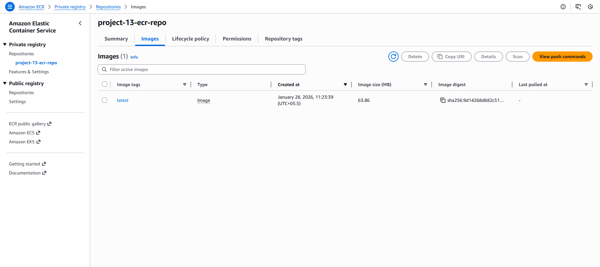

# Project 13 – Build Image and Push to Amazon ECR

 

## Goal

Publish a Dockerized application to a container registry by building a Docker image and pushing it to **Amazon Elastic Container Registry (ECR)**.

 

---

 

## Description

In this project, a simple application was containerized using Docker.  

The Docker image was built locally, tagged appropriately, and pushed to an Amazon ECR repository.  

This demonstrates how container images are published to a cloud registry for later deployment.

 

---

 

## Tasks Completed

- Created a Dockerfile for the application

- Built Docker image locally

- Created an Amazon ECR repository

- Authenticated Docker with Amazon ECR

- Tagged and pushed the Docker image to ECR

 

---

 

## ECR Screenshot (Proof of Work)

 

### Docker Image Successfully Pushed to ECR



 

---

 

## Project Structure

 

```text

project-13-ecr/

├── Dockerfile

├── index.html

├── README.md

└── screenshots/

    └── ecr-image.png
