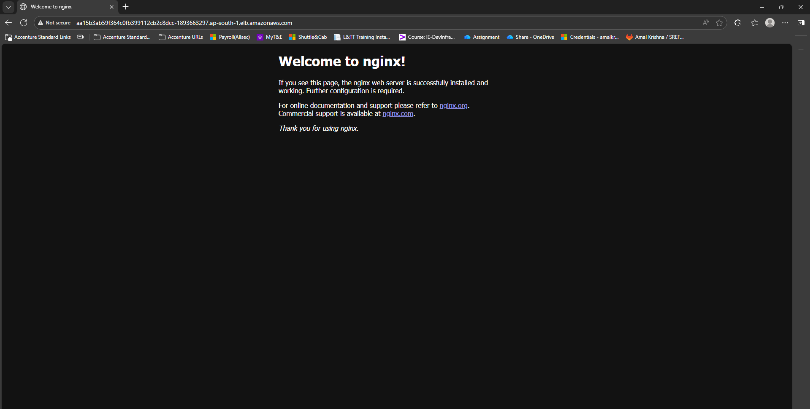

# Project 14 – App Deployment using Amazon EKS

 

## Goal

Deploy a containerized application on **Amazon Elastic Kubernetes Service (EKS)** and expose it publicly using Kubernetes.

 

---

 

## Project Overview

This project demonstrates deploying a Docker image from Amazon ECR onto a managed Kubernetes cluster using Amazon EKS and making the application accessible over the internet through a Kubernetes Service.

 

---

 

## Steps Performed

 

1. Installed and verified required tools including AWS CLI, `kubectl`, and `eksctl`.

 

2. Created an Amazon EKS cluster with a managed node group using `eksctl`.

 

3. Verified successful cluster and node group creation through AWS CloudFormation in the AWS Console.

 

4. Configured `kubectl` access to the EKS cluster automatically via `eksctl`.

 

5. Verified that all Kubernetes worker nodes were in the `Ready` state using `kubectl get nodes`.

 

   

 

6. Created a Kubernetes Deployment manifest referencing the Docker image stored in Amazon ECR.

 

7. Applied the Deployment to the EKS cluster to create application pods.

 

8. Created a Kubernetes Service of type `LoadBalancer` to expose the application publicly.

 

9. Retrieved the external load balancer endpoint assigned by AWS.

 

10. Accessed the application using the public endpoint to confirm successful deployment.

 

   

 

---

 

## Infrastructure Verification

 

The EKS cluster and managed node group were provisioned and tracked using AWS CloudFormation.

 


 

---

 

## Project Structure

 

```text

project-14-eks/

├── deployment.yaml

├── service.yaml

├── README.md

└── screenshots/

    ├── cloudformation-stack-console.png

    ├── kubectl-get-nodes.png

    └── eks-public-access.png


```

---

## Conclusion


This project demonstrates end-to-end deployment of a containerized application on Amazon EKS, from cluster provisioning to public service exposure. It validates practical skills in Kubernetes, AWS-managed infrastructure, and cloud-native application deployment, reflecting real-world DevOps and production deployment workflows.
