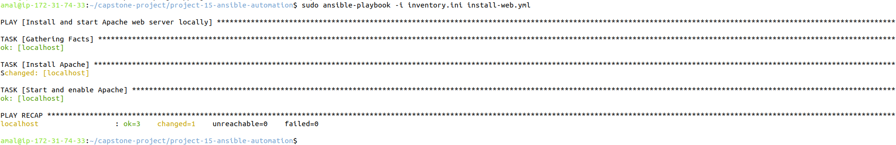
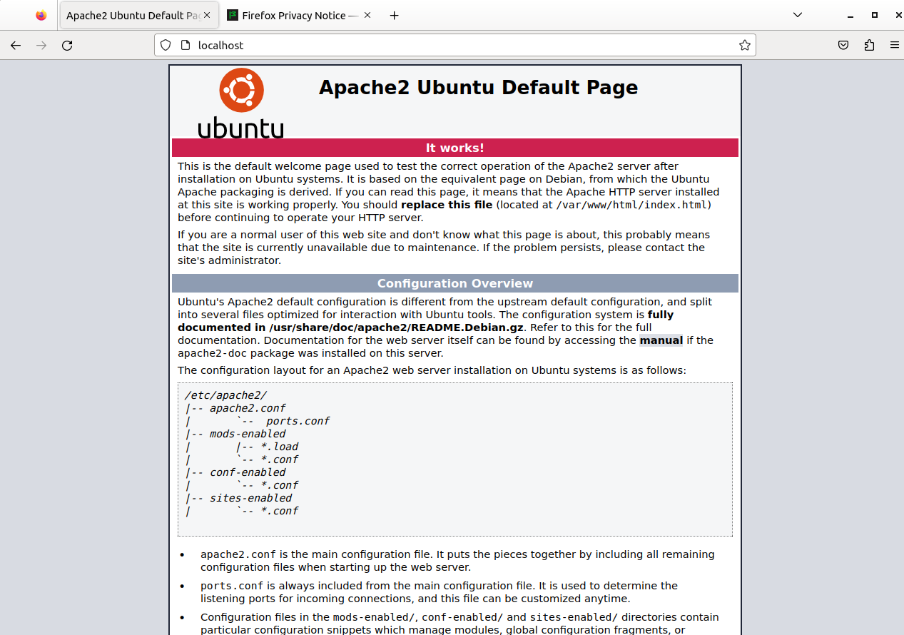

# Project 15 – Automate Server Configuration with Ansible
 
## Goal
Automate server configuration using Ansible by installing and running a web server through a playbook.
 
---
 
## Project Overview
This project demonstrates configuration automation using Ansible.  
An Ansible controller was configured to manage the local machine using the `local` connection plugin, and a playbook was executed to install and start a web server, validating the automation workflow.
 
---
 
## Steps Performed
 
1. Installed and verified Ansible on the Linux controller machine.
2. Configured an Ansible inventory to target the local system using the local connection.
3. Created an Ansible playbook to install and start the Apache web server.
4. Executed the playbook successfully using Ansible.
5. Verified the web server by accessing it through a web browser using `localhost`.
 
---
 
## Playbook Execution (Proof)
 
The following screenshot shows the successful execution of the Ansible playbook with all tasks completed without errors.
 

 
---
 
## Web Server Verification
 
The following screenshot confirms that the web server installed via Ansible is running and accessible through the browser.
 

 
---
 
## Project Structure
 
```text
project-15-ansible/
├── inventory.ini
├── install-web.yml
├── README.md
└── screenshots/
    ├── playbook-run.png
    └── apache-running.png
```
---
## Conclusion
 
This project demonstrates the use of Ansible for configuration automation by executing a playbook to install and manage a web server. The successful playbook execution and browser verification confirm that Ansible can be effectively used to automate server setup tasks in a repeatable and reliable manner.
