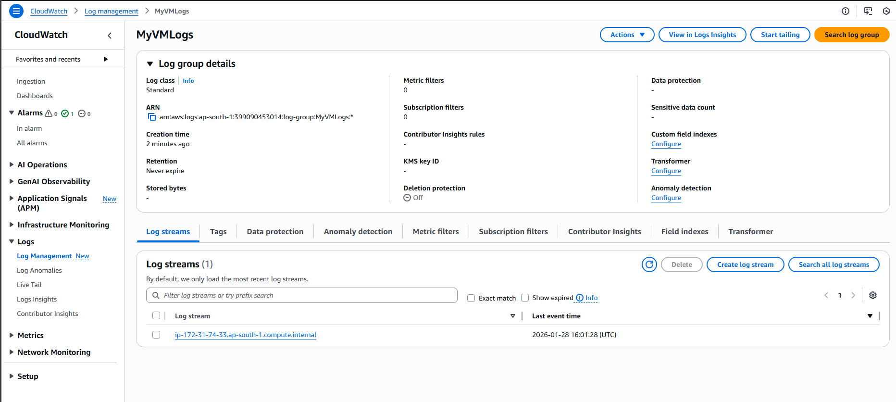

# Project 17: Log Forwarding to CloudWatch (Local VM)
 
## Objective
Implement centralized log management by forwarding logs from a local Linux VM
to Amazon CloudWatch Logs without using an EC2 instance.
 
---
 
## Architecture
Local Linux VM → CloudWatch Agent → Amazon CloudWatch Logs
 
---
 
## Tools & Services Used
- Amazon CloudWatch
- CloudWatch Agent
- AWS CLI
- Linux (Ubuntu VM)
 
---
 
## Logs Forwarded
- `/var/log/syslog`
- `/var/log/auth.log`
 
---
 
## Configuration Files
- `config.json` – CloudWatch Agent configuration file used to define log groups,
  log streams, and log file paths.
 
---
 
## Setup Summary
1. Created IAM user with `CloudWatchAgentServerPolicy`
2. Installed and configured AWS CLI on local VM
3. Installed CloudWatch Agent on VM
4. Configured log forwarding using `config.json`
5. Verified logs in CloudWatch Log Groups
6. Created CloudWatch Dashboard for log monitoring
 
---
 
## Project Structure
 
```text
project-17-log-forwarding/
├── config.json
├── README.md
└── screenshots/
    ├── dashboard.png
```
---
 
## Dashboard
The CloudWatch dashboard displays real-time logs forwarded from the local VM.
 
 

 
---
 
## Outcome
- Logs successfully streamed from local VM to CloudWatch
- Centralized log visibility achieved
- Dashboard created for monitoring
 
---
 
## Notes
This setup uses an **on-premise (non-EC2) VM** with IAM access keys and does not
require an EC2 instance.
 
 
---
## Conclusion
This project successfully demonstrates centralized log management by forwarding
system logs from a local Linux virtual machine to Amazon CloudWatch without using
an EC2 instance. By installing and configuring the CloudWatch Agent with proper
IAM permissions, logs were securely streamed and monitored in real time.
 
The implementation validates that on-premise or non-EC2 systems can be effectively
integrated with AWS monitoring services. The CloudWatch dashboard provides a
centralized view of logs, improving visibility, troubleshooting efficiency, and
operational monitoring. This setup reflects a practical, real-world logging
solution commonly used in DevOps and cloud-native environments.
