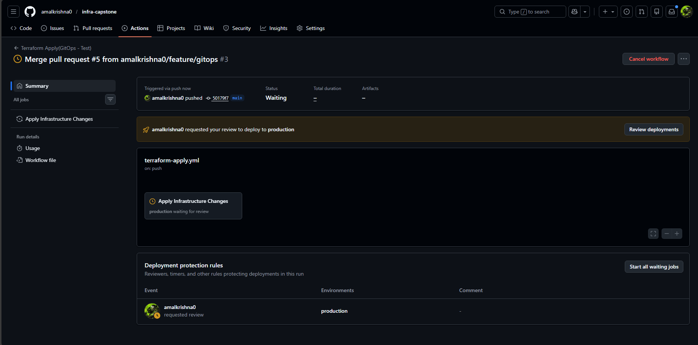
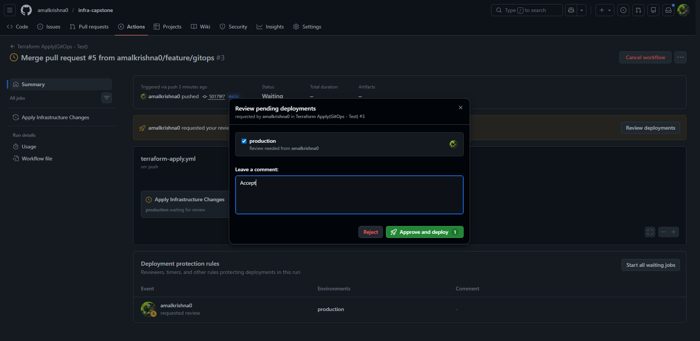
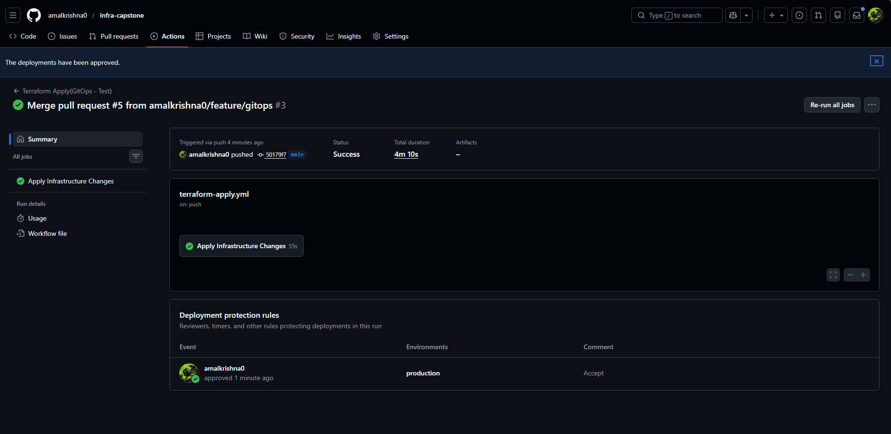

# Project 18 – GitOps Infrastructure Deployment
 
## Goal
Trigger infrastructure updates using GitOps principles by applying Terraform changes only after Pull Request approval.
 
---
 
## Project Overview
This project demonstrates a GitOps-based infrastructure deployment workflow using GitHub Actions and Terraform. Infrastructure changes are automatically applied only after code changes are pushed to a controlled branch and approved through a protected production environment, ensuring safe and auditable deployments.
 
---
 
## Workflow Summary
- Terraform apply is triggered automatically on pushes to a feature branch.
- A production environment approval gate is enforced before applying infrastructure changes.
- Terraform apply executes only after manual reviewer approval.
- Infrastructure deployment is fully automated and controlled through GitHub.
 
---
 
## Steps Performed
 
1. Created a dedicated feature branch to safely test GitOps-based Terraform apply.
2. Configured a GitHub Actions workflow to run Terraform apply on branch push.
3. Added a production environment with required reviewer approval.
4. Paused the workflow automatically until approval was granted.
5. Approved the deployment manually through GitHub.
6. Applied Terraform changes successfully after approval.
 
---
 
## GitOps Approval Flow (Proof)
 
### 1. Workflow Waiting for Approval
This screenshot shows the GitHub Actions workflow paused and waiting for manual approval before applying infrastructure changes.
 

 
---
 
### 2. Approval Granted
This screenshot shows the deployment being approved by the reviewer in the production environment.
 

 
---
 
### 3. Successful Terraform Apply
This screenshot confirms that Terraform apply executed successfully after approval.
 

 
---
 
## Project Structure
 
```text
project-18-gitops/
├── README.md
└── screenshots/
    ├── 01-gitops-waiting-for-approval.png
    ├── 02-gitops-approval-granted.png
    └── 03-gitops-apply-success.png
```
 
---
## Conclusion
This project demonstrates the implementation of GitOps best practices by enforcing approval-based infrastructure deployments. By integrating Terraform apply with GitHub Actions and protected environments, infrastructure changes are applied in a controlled, auditable, and production-safe manner.
