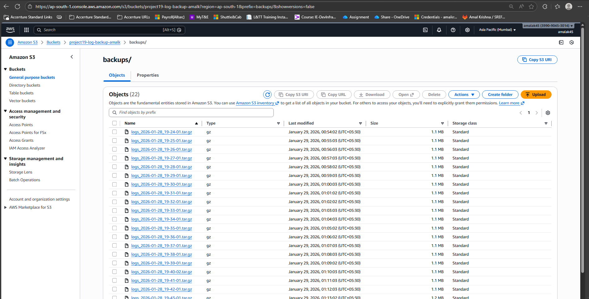

# Project 19 – Scheduled S3 Backup
 
## Goal
Automate a backup routine by periodically uploading log files from a Linux system to Amazon S3.
 
---
 
## Project Overview
This project demonstrates automated backups using a cron job on a Linux machine. System log files are periodically copied and uploaded to an Amazon S3 bucket using the AWS CLI, ensuring reliable and centralized backup storage.
 
---
 
## Steps Performed
 
1. Configured AWS CLI on the Linux system using IAM user credentials.
2. Created an Amazon S3 bucket to store backup files.
3. Wrote a shell script to copy system log files and upload them to S3.
4. Tested the backup script manually to ensure successful uploads.
5. Scheduled the script to run automatically using a cron job.
6. Verified that backup files were created in the S3 bucket at scheduled intervals.
 
---
 
## Automated Backup Script
The backup script copies the system log file and uploads it to the configured S3 bucket with a timestamped filename.
 
---
 
## Backup Verification (Proof)
 
The screenshot below shows multiple backup files successfully uploaded to the Amazon S3 bucket by the cron job.
 

 
---
 
## Project Structure
 
```text
project-19-s3-backup/
├── backup.sh
├── README.md
└── screenshots/
    └── s3-backup-files.png
```
 
---
 
## Conclusion
This project demonstrates how scheduled automation can be used to reliably back up system logs to Amazon S3. By combining shell scripting, cron scheduling, and AWS services, the solution ensures consistent backups with minimal manual intervention.'
