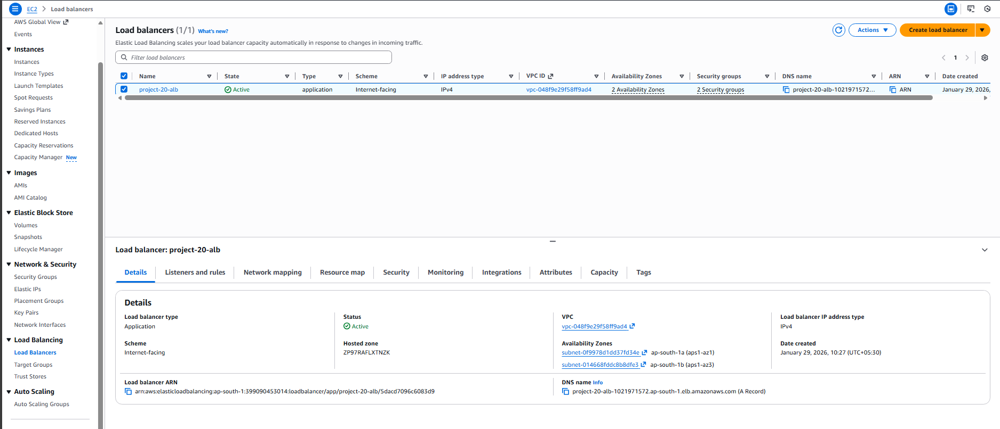
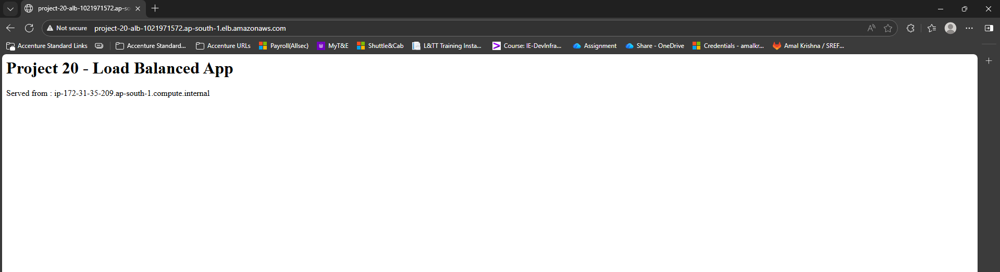
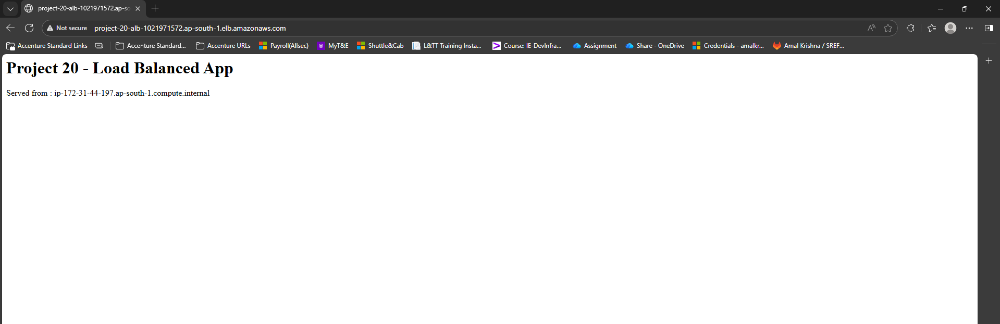

# Project 20 – Load Balanced App Deployment

 

## Goal

Improve application scalability and availability by deploying multiple EC2 instances behind an Application Load Balancer (ALB).

 

---

 

## Project Overview

This project demonstrates a load-balanced web application architecture on AWS using an Application Load Balancer and two EC2 instances.  

Incoming traffic is distributed across the instances, improving reliability and performance.

 

---

 

## Steps Performed

 

1. Launched two EC2 instances running a web server to serve application content.

2. Configured a security group to allow HTTP traffic on port 80.

3. Created a target group and registered both EC2 instances.

4. Configured health checks to monitor instance availability.

5. Created an Application Load Balancer and attached it to the target group.

6. Verified traffic distribution by accessing the application through the ALB DNS name.

 

---

 

## Load Balancing Verification (Proof of Work)

 

### Application Load Balancer Configuration

The screenshot below shows the Application Load Balancer configuration in the AWS Console.

 



 

---

 

### Response from EC2 Instance 1

This screenshot shows the application response served from the first EC2 instance via the load balancer.

 



 

---

 

### Response from EC2 Instance 2

This screenshot shows the application response served from the second EC2 instance via the load balancer.

 



 

---

 

## Project Structure

 

```text

project-20-load-balanced-app/

├── README.md

└── screenshots/

    ├── load-balancer-console.png

    ├── load-balancer-instance-1.png

    └── load-balancer-instance-2.png

```

---

## Conclusion

This project confirms the successful deployment of a load-balanced application using AWS services.

By distributing traffic across multiple EC2 instances through an Application Load Balancer, the application achieves improved availability and scalability, reflecting real-world cloud architecture best practices.

   
