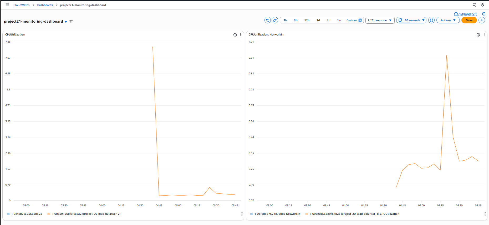

# Project 21 – CloudWatch Monitoring Dashboard

 

## Goal

Visualize system performance by creating a monitoring dashboard using Amazon CloudWatch.

 

---

 

## Project Overview

This project demonstrates the creation of a CloudWatch dashboard to monitor the performance of AWS resources.  

CPU utilization metrics for two EC2 instances behind an Application Load Balancer are visualized to observe system load and behavior.

 

---

 

## Steps Performed

 

1. Opened Amazon CloudWatch and created a new monitoring dashboard.

2. Added EC2 CPU Utilization metrics to the dashboard.

3. Selected both EC2 instances associated with the load-balanced application.

4. Configured the dashboard to display CPU usage for each instance.

5. Verified that metrics were updating correctly in real time.

 

---

 

## Monitoring Dashboard (Proof of Work)

 

The screenshot below shows CPU utilization metrics for two EC2 instances running behind a load balancer.

 



 

---

 

## Project Structure

 

```text

project-21-cloudwatch-dashboard/

├── README.md

└── screenshots/

    └── cloudwatch-dashboard.png

```


---

## Conclusion

This project demonstrates how Amazon CloudWatch can be used to visualize and monitor the performance of AWS infrastructure.

By tracking CPU utilization across multiple EC2 instances, system load and application behavior can be easily analyzed, supporting effective monitoring and operational visibility.
