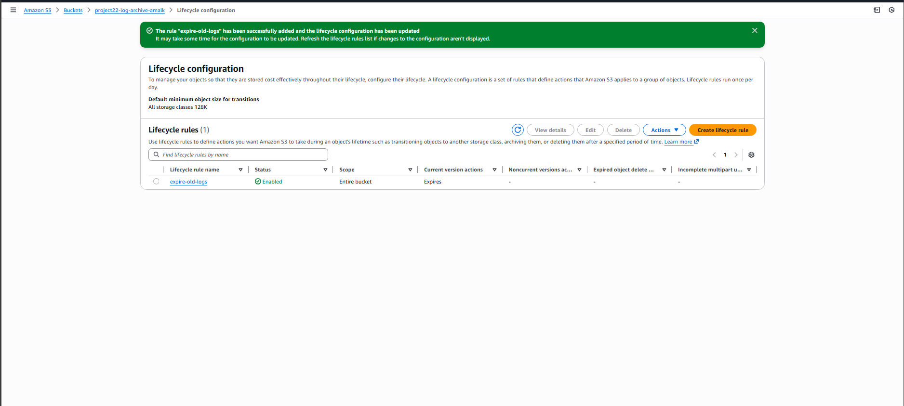

# Project 22 – S3 Log Archive with Lifecycle
 
## Goal
Reduce storage costs by archiving log files in Amazon S3 and applying a lifecycle expiration policy.
 
---
 
## Project Overview
This project demonstrates how Amazon S3 can be used as a low-cost log archive by storing log files and automatically deleting them after a defined retention period using lifecycle rules.
 
---
 
## Steps Performed
 
1. Created an Amazon S3 bucket to store application log files.
2. Uploaded sample log files into the bucket under a dedicated `logs/` prefix.
3. Configured an S3 lifecycle rule to manage log retention.
4. Set an expiration policy to automatically delete old log files after a defined number of days.
5. Verified that the lifecycle rule was enabled and applied correctly.
 
---
 
## Lifecycle Rule Configuration (Proof of Work)
 
The screenshot below shows the S3 lifecycle rule configured to expire archived log files.
 

 
---
 
## Project Structure
 
```text
project-22-s3-log-archive/
├── README.md
└── screenshots/
    └── s3-lifecycle-rule.png
