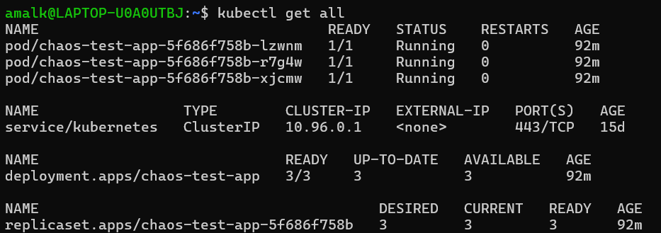
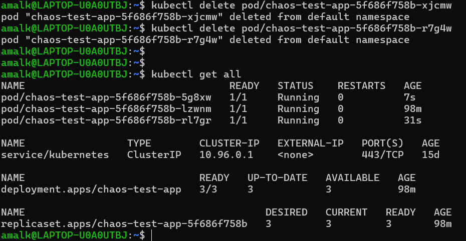

# Project 24 – Manual Chaos Test

## Goal
Record system recovery behavior after introducing a controlled failure.

---

## Chaos Test Description
A manual chaos test was performed in a Kubernetes environment by deleting running pods and observing automatic recovery by the Deployment controller.

---

## Steps Performed

1. Verified that all application pods were running normally using `kubectl get pods`.
2. Manually deleted two running pods to simulate a failure.
3. Observed Kubernetes automatically recreating the deleted pods.
4. Verified that the application returned to a healthy running state.

---

## Incident Notes

- **Failure Introduced:** Manual deletion of running Kubernetes pods  
- **Impact:** Pods were temporarily terminated  
- **Recovery Action:** Kubernetes automatically recreated the pods  
- **Outcome:** Application recovered successfully without manual intervention  

---

## Screenshots (Proof of Work)

### Before Chaos Test
Shows all pods running normally before failure injection.



---

### After Chaos Test
Shows new pods running after deletion, proving automatic recovery.



---

## Project Structure

```text
project-24-chaos-test/
├── README.md
└── screenshots/
    ├── kubectl-get-pods-before.png
    └── kubectl-get-pods-after.png

```

---

## Conclusion
This chaos test demonstrates Kubernetes self-healing behavior by automatically recovering from pod-level failures, ensuring application resilience.
